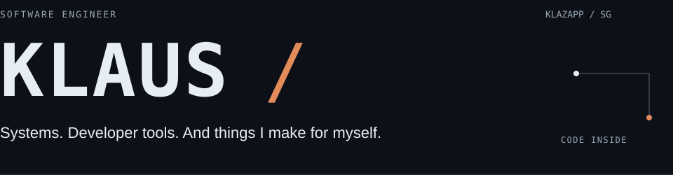
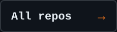
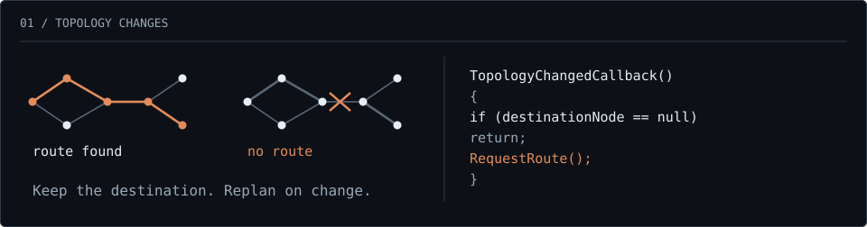
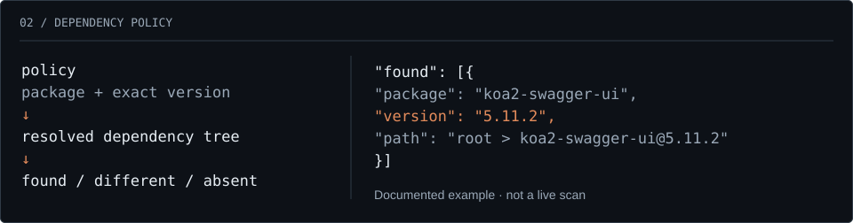
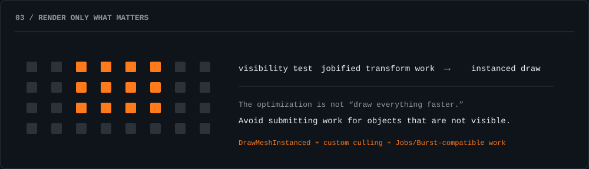
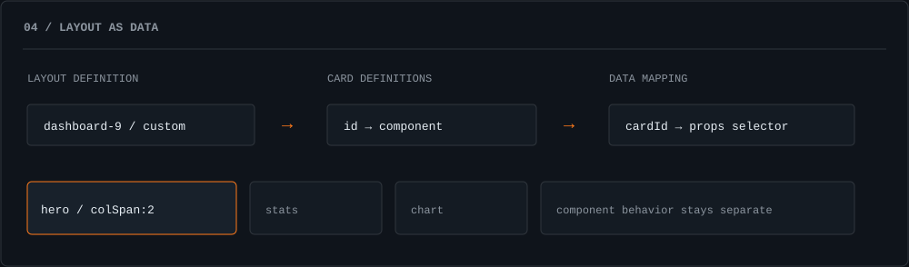

<!-- Dark-only artwork. The surrounding GitHub page follows the viewer's own theme. -->
<a name="top"></a>

<picture>
  <source media="(max-width: 600px)" srcset="assets/casebook/hero-mobile.svg">
  
</picture>

<br>

I've spent **11 years building production software**, from enterprise web platforms to C#/Unity runtimes. This is where I share my own tools, engineering experiments and mobile products.

<p>
  <a href="#runtime"></a>
  <a href="#tooling"></a>
  <a href="#ui"></a>
  <a href="#products"></a>
  <a href="https://github.com/klazapp?tab=repositories"></a>
</p>

## Featured cases

Four things I've built. Open the notes to inspect the decisions.

<a name="runtime"></a>

### `01` The bridge disappears mid-route

<sub>C# / Unity / Runtime navigation</sub>

The destination hasn't changed. The graph has. I separated navigation from the scene and kept the pending destination so the journey can recover when connectivity returns.

<a href="notes/01-route.md">
<picture>
  <source media="(max-width: 600px)" srcset="assets/casebook/route-mobile.svg">
  
</picture>
</a>

[Repository ↗](https://github.com/klazapp/UNITY-GridBased-Pathfinding) · [Controller source](https://github.com/klazapp/UNITY-GridBased-Pathfinding/blob/main/Assets/Scripts/Player/PlayerController.cs) · [Original routing GIF](https://github.com/klazapp/UNITY-GridBased-Pathfinding/blob/main/Assets/Gif%20Showcase/Gifshowcase.gif)

<details>
<summary><strong>The bridge reopens. Does the player need another click?</strong></summary>

No. The controller keeps `destinationNode` when a route cannot be found. A later `TopologyChanged` event calls `RequestRoute()` again. Reaching the destination clears that intent.

```csharp
// PlayerController.cs — implementation excerpt
private void TopologyChangedCallback()
{
    if (destinationNode == null)
        return;

    RequestRoute();
}
```

**The boundary:** the navigation assembly has `noEngineReferences: true`. The route finder consumes a read-only graph interface, not Unity transforms.

**The trade-off:** this implementation replans on any topology-change event while a destination is pending. That's straightforward, but high-frequency mutations or many agents would justify coalescing updates or more selective invalidation.

[Read the case note →](notes/01-route.md) · [Inspect the navigation layer](https://github.com/klazapp/UNITY-GridBased-Pathfinding/tree/main/Assets/Scripts/Navigation) · [Inspect the tests](https://github.com/klazapp/UNITY-GridBased-Pathfinding/tree/main/Assets/Tests/EditMode)

</details>

---

<a name="tooling"></a>

### `02` The package isn't in your package.json

<sub>TypeScript / Node.js / Dependency tooling</sub>

A dependency can arrive through another dependency. I built Package Scan to compare the resolved tree with an explicit package/version list and return findings that people and automation can use.

<a href="notes/02-policy.md">
<picture>
  <source media="(max-width: 600px)" srcset="assets/casebook/scan-mobile.svg">
  
</picture>
</a>

[Repository ↗](https://github.com/klazapp/typescript-package-scan) · [Matching logic](https://github.com/klazapp/typescript-package-scan/blob/main/src/compare.ts) · [CLI and reports](https://github.com/klazapp/typescript-package-scan/blob/main/src/cli.ts)

<details>
<summary><strong>No matches. Does that mean the dependency tree is safe?</strong></summary>

No. It means the configured targets did not match the inspected tree. The policy and the tree still determine what the tool can see.

The comparison returns three categories:

```typescript
return { found, presentDifferent, notFound };
```

Matching findings retain a dependency path. Reports can be written as JSON or CSV; the CLI also signals matches and execution failures with nonzero exit statuses.

**The boundary:** tree collection, policy matching and CLI reporting are separate concerns.

**The trade-off:** explicit version lists are auditable but need maintenance. The inspected matcher uses exact version strings, or any version when no versions are specified. It is not a vulnerability database or a semantic-version range engine.

[Read the case note →](notes/02-policy.md)

</details>

---

<a name="rendering"></a>

### `03` How much work can the renderer avoid?

<sub>C# / Unity Jobs / Burst / Instancing</sub>

I combined custom culling with jobified transform updates and instanced drawing. The interesting part is deciding which work belongs on the CPU, which can be parallelized, and which should never reach draw submission.

<a href="notes/03-rendering.md">
<picture>
  <source media="(max-width: 600px)" srcset="assets/casebook/render-mobile.svg">
  
</picture>
</a>

[Repository ↗](https://github.com/klazapp/UNITY-DMICustomDrawCall-Jobified) · [Recorded demo GIF](https://github.com/klazapp/UNITY-DMICustomDrawCall-Jobified/blob/main/Assets/GifShowCase/Showcase-1-Bounce.gif) · [Implementation](https://github.com/klazapp/UNITY-DMICustomDrawCall-Jobified/tree/main/Assets/Scripts)

<details>
<summary><strong>Is doing more culling always faster?</strong></summary>

No. Culling adds its own work. It pays off only when the avoided rendering cost is worth more than the visibility checks, scheduling and data preparation.

The project combines a jobified culling system, jobified position/scale/rotation updates, and material property blocks for per-instance colour.

**The trade-off:** reducing submitted geometry can help one bottleneck while leaving another unchanged. A useful comparison holds the scene, camera, hardware and build settings constant, then measures both CPU and GPU time.

**What is published:** a working experiment and recorded demo. The repository lists the jobified/non-jobified comparison as future work; this profile does not present it as a completed benchmark.

[Read the case note →](notes/03-rendering.md)

</details>

---

<a name="ui"></a>

### `04` Layout as data, not component logic

<sub>React / TypeScript / UI systems</sub>

I built Bento Grid Builder to keep card components, layout placement and application-data mapping separate. Changing a dashboard arrangement shouldn't require rewriting what each card does.

<a href="notes/04-layout.md">
<picture>
  <source media="(max-width: 600px)" srcset="assets/casebook/layout-mobile.svg">
  
</picture>
</a>

[Repository ↗](https://github.com/klazapp/bento-grid-builder) · [Configuration examples](https://github.com/klazapp/bento-grid-builder#custom-layouts) · [Published preview](https://github.com/klazapp/bento-grid-builder/blob/main/assets/bento-preview.png)

<details>
<summary><strong>What changes when a card moves? What should stay the same?</strong></summary>

The placement changes. The component's job and its data contract should not need to change with it.

The library accepts component definitions, a layout specification and explicit data mappings. It supports presets, custom placements and breakpoint-specific arrangements.

```tsx
// API example using the documented layout builder
const layout = layoutBuilder(4)
  .gap(16)
  .place("hero", 1, 1, { colSpan: 2, rowSpan: 2 })
  .place("stats1", 3, 1)
  .place("stats2", 4, 1)
  .place("chart", 3, 2, { colSpan: 2 })
  .build();
```

**The trade-off:** a layout vocabulary adds indirection. It earns its place when arrangements vary or repeat—not when a one-off page would be clearer as ordinary CSS.

[Read the case note →](notes/04-layout.md)

</details>

---

<a name="products"></a>

## More things I've made

[**IDE Command Center**](https://github.com/klazapp/ide-command-center) — workspace-specific shortcuts for npm scripts, shell commands and VS Code actions.

[**Mobile products**](https://github.com/klazapp?tab=repositories&q=Mobile) — the games and applications I've shipped under Klazapp, with product showcases in the repositories.

<details>
<summary><strong>Production work, briefly</strong></summary>

My professional work also includes enterprise TypeScript/React/Node.js systems, cross-repository API contracts, dependency-ordered data migration, security tooling and controlled releases into isolated environments.

I've led a 13-person cross-functional team through delivery while staying involved in architecture and implementation. The public repositories above are my own tools and experiments, not copies of client systems.

[Professional background ↗](https://www.linkedin.com/in/klaus-vinn/)

</details>

<details>
<summary><strong>About this page</strong></summary>

The case illustrations are diagrams derived from the code and documentation, not screenshots or performance measurements. The recording and preview links open the original repository media.

The orange links navigate. The disclosure rows really expand. The page itself does not run the Unity demos or a terminal.

[Artwork source](tools/build_art.py) · [Case notes](notes/README.md)

</details>

---

**Klaus** / Singapore &nbsp; · &nbsp; [GitHub](https://github.com/klazapp) &nbsp; · &nbsp; [LinkedIn](https://www.linkedin.com/in/klaus-vinn/) &nbsp; · &nbsp; [Email](mailto:klazapp@klazapp.com) &nbsp; · &nbsp; [Back to top ↑](#top)
