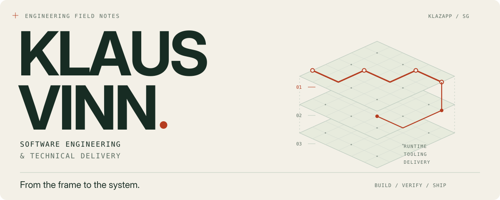
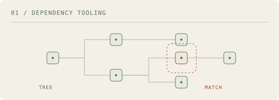
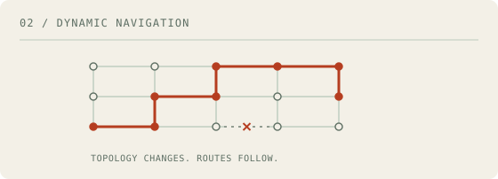
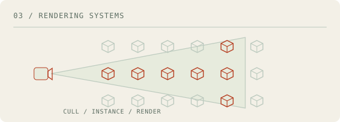
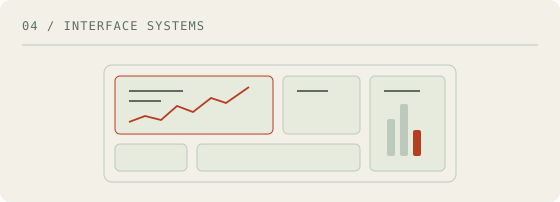
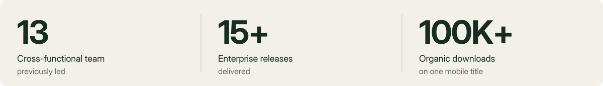

<!-- Custom artwork is stored locally in assets/. No external badge or stats services. -->
<picture>
  <source media="(max-width: 600px) and (prefers-color-scheme: dark)" srcset="assets/hero-dark-mobile.svg">
  <source media="(max-width: 600px)" srcset="assets/hero-light-mobile.svg">
  <source media="(prefers-color-scheme: dark)" srcset="assets/hero-dark.svg">
  
</picture>

  <a href="https://www.linkedin.com/in/klaus-vinn/">LinkedIn</a>
  &nbsp; / &nbsp;
  <a href="mailto:klaus.vinn@hotmail.com">Email</a>
  &nbsp; / &nbsp;
  <a href="#selected-work">Selected work</a>
  &nbsp; / &nbsp;
  <a href="#beyond-the-repository">Professional work</a>

### I build software — and take responsibility for getting it delivered.

I'm **Klaus**, a software engineering and technical-delivery leader based in Singapore. My work spans enterprise web platforms, high-performance C#/Unity systems, reusable developer tools and mobile products.

The thread through all of it: **make complex behaviour understandable, make repeated work reusable, and make delivery dependable.**

 

## Selected work

Four different problems. Code you can inspect.

<table>
  <tr>
    <td width="50%" valign="top">
      <a href="https://github.com/klazapp/typescript-package-scan">
<picture>
  <source media="(prefers-color-scheme: dark)" srcset="assets/scan-dark.svg">
  
</picture>
      </a>
      <h3><a href="https://github.com/klazapp/typescript-package-scan">Package Scan ↗</a></h3>
      
Check a dependency tree against a configurable list of packages and versions, with machine-readable reports and CI exit codes.

      
<strong>Look inside:</strong> Explicit matching rules, dependency paths and actionable results.

      
TypeScript · CLI · Dependency tooling

    </td>
    <td width="50%" valign="top">
      <a href="https://github.com/klazapp/UNITY-GridBased-Pathfinding">
<picture>
  <source media="(prefers-color-scheme: dark)" srcset="assets/graph-dark.svg">
  
</picture>
      </a>
      <h3><a href="https://github.com/klazapp/UNITY-GridBased-Pathfinding">Dynamic Navigation ↗</a></h3>
      
A navigation graph that changes with the world, with a scene-independent C# core and event-driven route recalculation.

      
<strong>Look inside:</strong> Boundaries between topology, route finding and scene behaviour.

      
C# · Graphs · Unity

    </td>
  </tr>
  <tr>
    <td width="50%" valign="top">
      <a href="https://github.com/klazapp/UNITY-DMICustomDrawCall-Jobified">
<picture>
  <source media="(prefers-color-scheme: dark)" srcset="assets/render-dark.svg">
  
</picture>
      </a>
      <h3><a href="https://github.com/klazapp/UNITY-DMICustomDrawCall-Jobified">Instanced Rendering ↗</a></h3>
      
Custom culling and mesh instancing, with jobified transform updates and per-instance material properties.

      
<strong>Look inside:</strong> The relationship between visibility, CPU work and draw submission.

      
C# · Unity Jobs · Burst

    </td>
    <td width="50%" valign="top">
      <a href="https://github.com/klazapp/bento-grid-builder">
<picture>
  <source media="(prefers-color-scheme: dark)" srcset="assets/bento-dark.svg">
  
</picture>
      </a>
      <h3><a href="https://github.com/klazapp/bento-grid-builder">Bento Grid Builder ↗</a></h3>
      
Configurable React layouts with responsive presets and explicit mappings between application data and card components.

      
<strong>Look inside:</strong> Separation of layout, data and rendering responsibilities.

      
React · TypeScript · UI systems

    </td>
  </tr>
</table>

<strong>More from the workbench</strong>

 

[**IDE Command Center**](https://github.com/klazapp/ide-command-center) — a configurable VS Code command launcher for npm scripts, shell commands and editor actions.

[**Explore the repositories →**](https://github.com/klazapp?tab=repositories)

 

## Beyond the repository

My professional work extends beyond the code published here. It includes enterprise API contracts, dependency-aware data migration, security tooling, release engineering and cross-functional delivery.

<picture>
  <source media="(max-width: 600px) and (prefers-color-scheme: dark)" srcset="assets/impact-dark-mobile.svg">
  <source media="(max-width: 600px)" srcset="assets/impact-light-mobile.svg">
  <source media="(prefers-color-scheme: dark)" srcset="assets/impact-dark.svg">
  
</picture>

**Enterprise engineering.** Built a cross-repository API contract layer covering 200+ endpoints and a metadata-driven migration engine with dependency ordering, ID resolution and safe reruns.

**Technical delivery.** Translated business requirements into implementation scope, estimates, dependencies and coordinated releases, with hands-on engineering throughout.

 

## How I approach the work

**Make boundaries explicit.** Keep domain rules separate from frameworks, runtime state and integration details.

**Design for the second run.** A migration, release or recovery procedure should account for what happens when it needs to run again.

**Leave the next engineer a system, not a puzzle.** Prefer clear contracts, repeatable workflows and documentation close to the code.

 

<strong>Tools & credentials</strong>

 

| Area | Technologies |
| :--- | :--- |
| Enterprise web | TypeScript, React, Node.js, SQL Server, TypeORM |
| Runtime & performance | C#, Unity, Jobs, Burst, GPU instancing |
| Developer tooling | Electron, VS Code extensions, CLI tooling, Git |

**PMP** · Professional Scrum Master I · Professional Scrum Product Owner I · AWS Certified AI Practitioner

---

  <strong>Good software is more than the code that runs.</strong> 
  It is also the clarity, decisions and delivery behind it.

  <a href="https://www.linkedin.com/in/klaus-vinn/">Start a conversation ↗</a>

